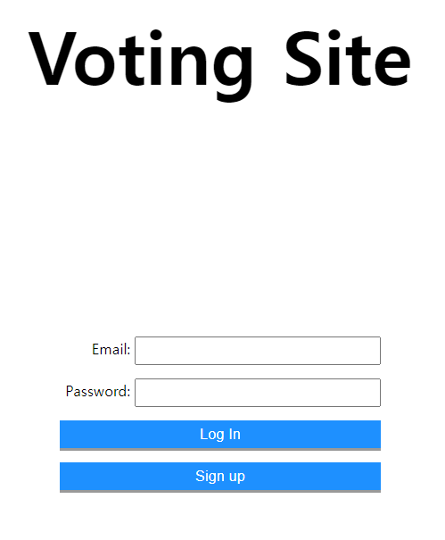

# React

> ## **개요**

 

### **React 이론을 공부한 후에 다양한 프로젝트를 만들면서 실전연습을 진행**

 

> ## **사용한 언어ㆍ개념**

 

### **Javascript (React)**

-   ### Styled-components
-   ### Router
-   ### Firebase로 데이터 교환

 

> ## **프로젝트**

  

## **To Do List**

  
 

## **카카오 채팅방**

  
 

## **투표사이트**

  
 
